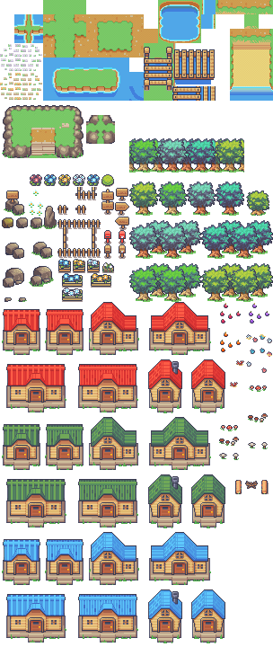
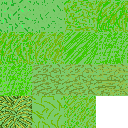
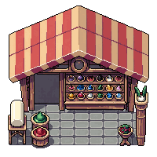
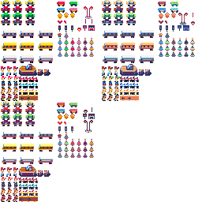
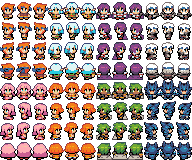
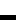

# Asset list
Third party assets are listed bellow. Many of the assets used are not quite the original but have been modified to fit the colours by the other assets.
|                                                  Asset                                                   |                                      Source                                       |        Creator       |  License  |
|----------------------------------------------------------------------------------------------------------|-----------------------------------------------------------------------------------|----------------------|-----------|
|                               | [limezu.itch.io](https://limezu.itch.io/serenevillagerevamped)                    | LimeZu               | [CC-BY 4.0](https://creativecommons.org/licenses/by/4.0/) |
|                                               | [opengameart.org](https://opengameart.org/content/17-grass-tiles)                 | Hawkadium, geloesht  | [CC-BY 3.0](https://creativecommons.org/licenses/by/3.0/) |
|  | [zedpxl.itch.io](https://zedpxl.itch.io/pixelart-village-top-down-rpg-asset-pack) | zedpxl               | [Custom](#zepxl-custom-license) |
|                              | [freepixel.art](https://freepixel.art/browse/topdown-buildings-props/)            | None listed          | [Custom](#freepixel-asset-license) |
|                           | [opengameart.org](https://opengameart.org/content/small-city-tilesets-8px-size-pixelart) | marceles             | [CC-BY 4.0](https://creativecommons.org/licenses/by/4.0/) |
|  | [karsiori.itch.io](https://karsiori.itch.io/free-pixel-art-trash-pack-animated) | KARSIORI STUDIO | [CC0](https://creativecommons.org/publicdomain/zero/1.0/) |
|                                          | [farm-animal.itch.io](https://farm-animal.itch.io/character-pack)                 | Gif (@gif_not_jif), Noiracide (@Noiracide), Romi (@DessRomaric) | [Custom](#super-retro-world-license)

Assets created by our team are:

# Custom Licenses
## zepxl custom License
This asset pack can be used in commercial and non-commercial projects. You can modify it for your needs, but you cannot resell or redistribute it, even if modified. You cannot use this asset pack for AI or NFT-related projects.
## FreePixel Asset License
Every free asset on FreePixel — sprites, characters, tilesets, backgrounds, UI elements, and audio — is free to use in personal and commercial projects, including games you sell. No attribution is required, and there are no download limits, royalties, or fees.
Full license can be found at [https://freepixel.art/license/](https://freepixel.art/license/)
## Super Retro World License
Are you using those assets ?  Well, thank you ! Please mind the section below. 

! You need to :
 - Credit the authors mention our social account (Twitter) : 
	Gif (@gif_not_jif)
	Noiracide (@Noiracide)
	Romi (@DessRomaric)

✔️ You can :
 - Use the assets for non-commercial AND commercial project.
 - Adapt and/or modify the assets to match your project.

❌ You can NOT :
 - Distribute or sell those assets directly (even modified).
 - Claim the asset yours.
 - Use the assets for a NFT/metaverse/IA project.

Depending of your project, we appreciate if you can encrypt your assets data when distributing on the internet (to prevent theft).

The license is the same for each asset pack of the Super Retro World collection.